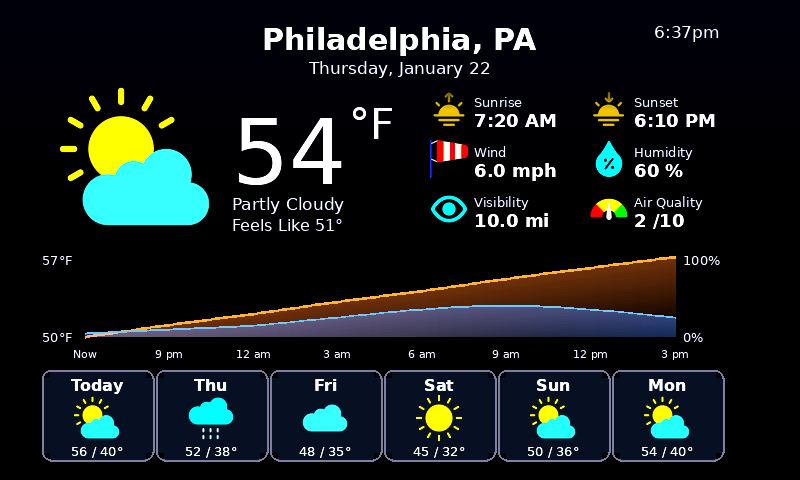

# Raspberry Pi Weather Dashboard

A beautiful weather display for your Raspberry Pi! Shows current weather, hourly forecasts with graphs, and a 6-day outlook on an e-ink screen that updates automatically.



## What It Does

This dashboard displays:
- **Current temperature** with weather icon
- **Weather details** - sunrise/sunset, wind, humidity, visibility, air quality
- **Hourly graph** - temperature (orange) and rain chance (blue) for the next 30 hours
- **6-day forecast** - daily high/low temperatures with weather icons

The display refreshes every 20 minutes and starts automatically when you power on your Pi.

---

## Hardware You'll Need

| Item | Description | Where to Buy |
|------|-------------|--------------|
| **Raspberry Pi Zero 2 W** | Small, affordable Pi with WiFi | [Adafruit](https://www.adafruit.com/product/5291), [PiShop](https://www.pishop.us/) |
| **Pimoroni Inky Impression 7.3"** | Color e-ink display (800x480) | [Pimoroni](https://shop.pimoroni.com/products/inky-impression-7-3) |
| **MicroSD Card** | 8GB or larger | Any electronics store |
| **USB-C Power Supply** | 5V 2.5A for Pi Zero 2 W | [Adafruit](https://www.adafruit.com/product/4298) |
| **MicroSD Card Reader** | To flash the SD card | Any electronics store |

**Optional but helpful:**
- Mini HDMI adapter (for initial setup with monitor)
- USB OTG adapter (for keyboard during setup)
- Case or frame for the display

---

## Software Requirements

- **Raspberry Pi OS** (Lite or Desktop) - [Download here](https://www.raspberrypi.com/software/)
- **OpenWeatherMap API Key** (free) - [Sign up here](https://openweathermap.org/api)

---

## Step-by-Step Setup

### Step 1: Set Up Your Raspberry Pi

If you're new to Raspberry Pi:

1. Download [Raspberry Pi Imager](https://www.raspberrypi.com/software/)
2. Insert your MicroSD card into your computer
3. Open Raspberry Pi Imager and:
   - Choose **Raspberry Pi OS Lite (64-bit)** as the OS
   - Click the gear icon (⚙️) to configure:
     - Set hostname (e.g., `pizero`)
     - Enable SSH
     - Set username and password
     - Configure your WiFi network
   - Click **Write** to flash the card
4. Insert the SD card into your Pi and power it on
5. Wait 2-3 minutes for first boot

### Step 2: Connect to Your Pi

From your computer's terminal (Mac/Linux) or PowerShell (Windows):

```bash
ssh yourname@pizero.local
```

Replace `yourname` with the username you set. Enter your password when prompted.

### Step 3: Connect the Display

1. Power off your Pi: `sudo shutdown now`
2. Attach the Inky Impression display to the GPIO header
3. Power the Pi back on

### Step 4: Get an OpenWeatherMap API Key

1. Go to [OpenWeatherMap](https://openweathermap.org/api)
2. Click **Sign Up** and create a free account
3. Go to **API Keys** in your account
4. Copy your API key (you'll need this in Step 6)

### Step 5: Install the Weather Dashboard

SSH into your Pi and run these commands:

```bash
# Clone the repository
git clone https://github.com/J-Thomp/Raspberry-Pi-Weather-Dashboard.git

# Enter the directory
cd Raspberry-Pi-Weather-Dashboard

# Run the installer (this takes a few minutes)
sudo bash install.sh
```

The installer will:
- Install Python and required packages
- Enable SPI for the display
- Set up the service to run on boot

### Step 6: Configure Your Location

```bash
# Copy the example config
cp .env.example .env

# Edit the config file
nano .env
```

Update these values:

```
OPENWEATHER_API_KEY=paste_your_api_key_here
CITY_NAME=Philadelphia
COUNTRY_CODE=US
STATE_CODE=PA
UNITS=imperial
```

**Settings explained:**
- `OPENWEATHER_API_KEY` - Your API key from Step 4
- `CITY_NAME` - Your city name
- `COUNTRY_CODE` - Two-letter country code (US, UK, CA, etc.)
- `STATE_CODE` - Two-letter state code (US only, optional)
- `UNITS` - `imperial` (°F), `metric` (°C), or `kelvin`

Save the file: Press `Ctrl + O`, then `Enter`, then `Ctrl + X`

### Step 7: Test the Display

```bash
python3 weather_dashboard.py --test
```

You should see the weather display update! If it works, continue to the next step.

### Step 8: Start the Service

```bash
sudo bash start_service.sh
```

The dashboard will now:
- Run automatically on boot
- Update every 20 minutes
- Restart automatically if it crashes

---

## Useful Commands

```bash
# Check if the service is running
sudo systemctl status weather-dashboard

# View live logs
journalctl -u weather-dashboard -f

# Restart the service
sudo systemctl restart weather-dashboard

# Stop the service
sudo systemctl stop weather-dashboard

# Start the service
sudo systemctl start weather-dashboard

# Run a manual update
python3 weather_dashboard.py --test
```

---

## Customization

### Change Update Frequency

Edit `config.py`:

```bash
nano config.py
```

Change `UPDATE_INTERVAL_MINUTES = 20` to your preferred interval.

### Hide Weather Details

In `config.py`, set any of these to `False`:

```python
SHOW_FORECAST = True      # 6-day forecast
SHOW_HUMIDITY = True      # Humidity display
SHOW_WIND = True          # Wind speed
SHOW_PRESSURE = True      # Barometric pressure
```

---

## Troubleshooting

### "API key not found" error

- Make sure your `.env` file exists: `ls -la .env`
- Check the API key is correct: `cat .env`
- Ensure there are no extra spaces around the `=` sign

### Display not updating

Check if the display is detected:
```bash
python3 -c "from inky.auto import auto; print(auto())"
```

If you see an error:
- Make sure SPI is enabled: `sudo raspi-config` → Interface Options → SPI → Enable
- Reboot: `sudo reboot`
- Check the display is firmly connected to the GPIO header

### Weather data not loading

- Check internet connection: `ping google.com`
- Verify your city name is spelled correctly
- Run the test script: `python3 test_setup.py`

### Service not starting

View detailed logs:
```bash
journalctl -u weather-dashboard -n 50
```

---

## Project Files

```
Raspberry-Pi-Weather-Dashboard/
├── weather_dashboard.py      # Main application
├── weather_api.py            # Fetches weather from OpenWeatherMap
├── weather_display_pil.py    # Renders the display image
├── config.py                 # Configuration settings
├── icons/                    # Weather icon images
├── install.sh                # Installation script
├── start_service.sh          # Service setup script
├── weather-dashboard.service # Systemd service file
├── requirements.txt          # Python dependencies
├── .env.example              # Example configuration
├── test_setup.py             # Test your installation
└── download_icons.py         # Download/update icons
```

---

## Tech Stack

| Component | Technology |
|-----------|------------|
| Language | Python 3 |
| Display Driver | [Inky library](https://github.com/pimoroni/inky) |
| Image Rendering | [Pillow (PIL)](https://pillow.readthedocs.io/) |
| Weather Data | [OpenWeatherMap API](https://openweathermap.org/api) |
| Scheduling | [schedule](https://schedule.readthedocs.io/) |
| Process Manager | systemd |

---

## License

MIT License - feel free to use, modify, and share!

---

## Acknowledgments

- Weather data from [OpenWeatherMap](https://openweathermap.org/)
- Inspired by [InkyPi](https://github.com/fatihak/InkyPi)
- Built for [Pimoroni Inky Impression](https://shop.pimoroni.com/products/inky-impression) displays
